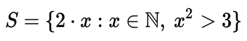

# List comprehension

List comprehension oferece uma sintaxe mais curta quando você deseja criar uma nova lista com base nos valores de uma lista existente

> introduzido ao Python na PEP 202 - Jul/2000 (PEP - Python Enhancement Proposals)
https://peps.python.org/pep-0202/

> Matemática

Segue uma forma de notação de definição de conjuntos matemáticos

S => é um conjunto de todos os números "2 vezes x", onde "x é um membro do conjunto de numeros naturais (N)", se "x ao quadrado for maior que 3"
